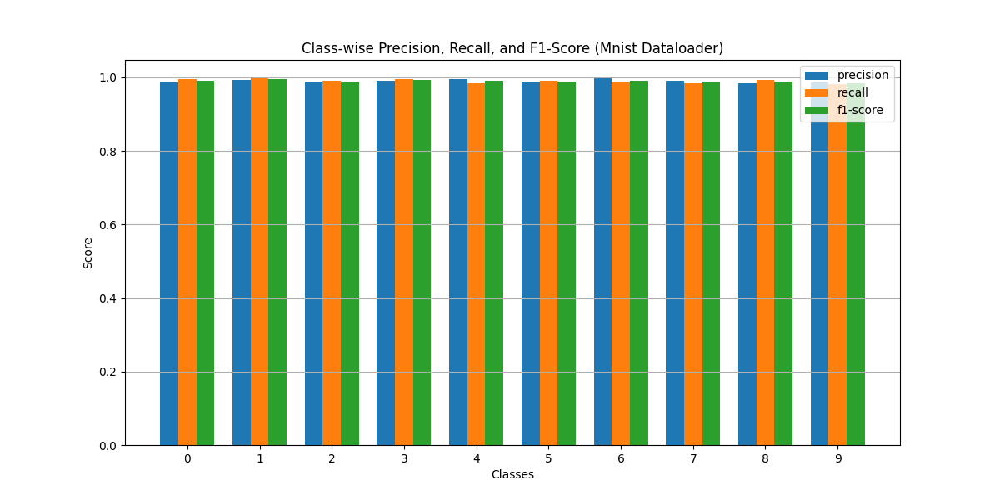
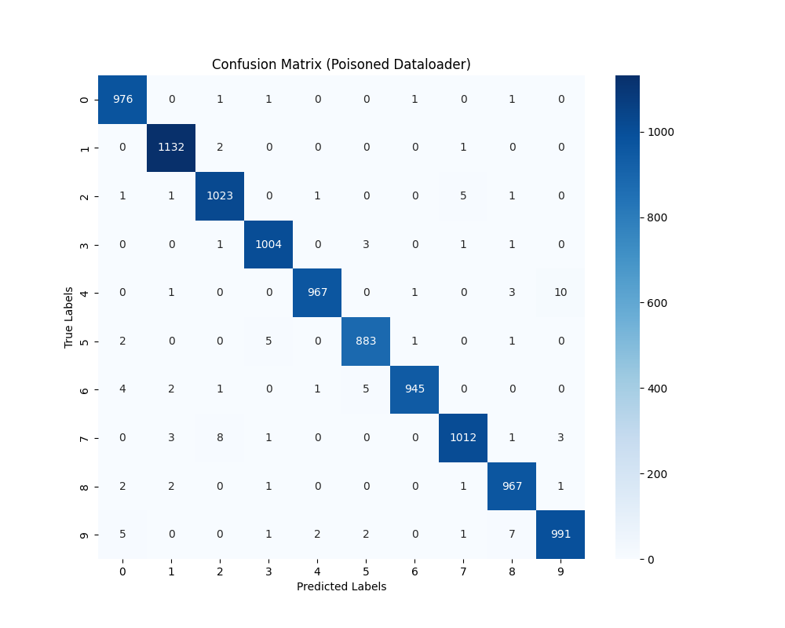
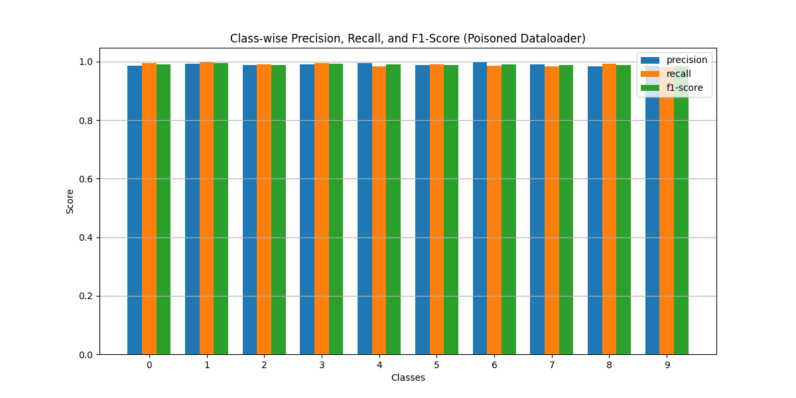
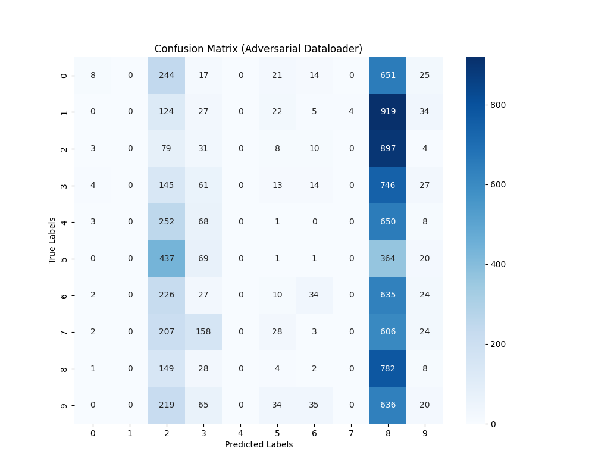
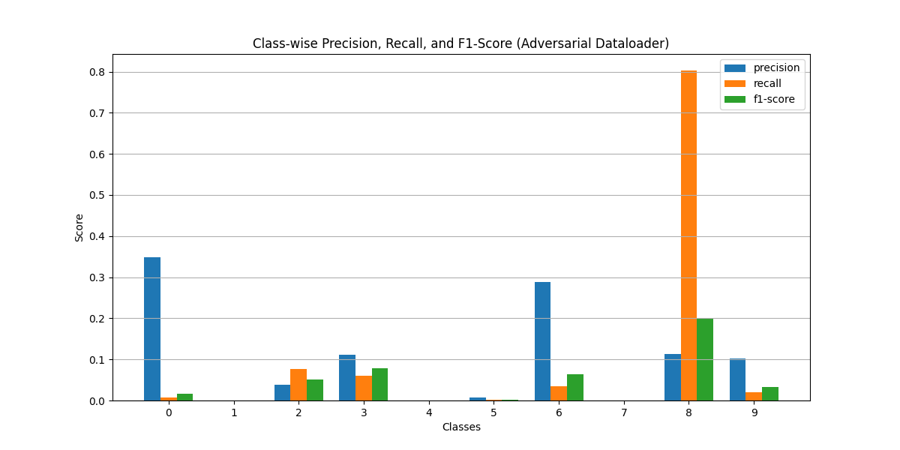
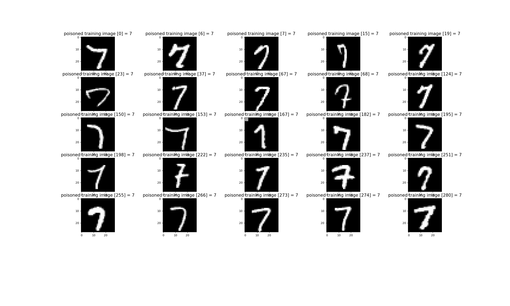
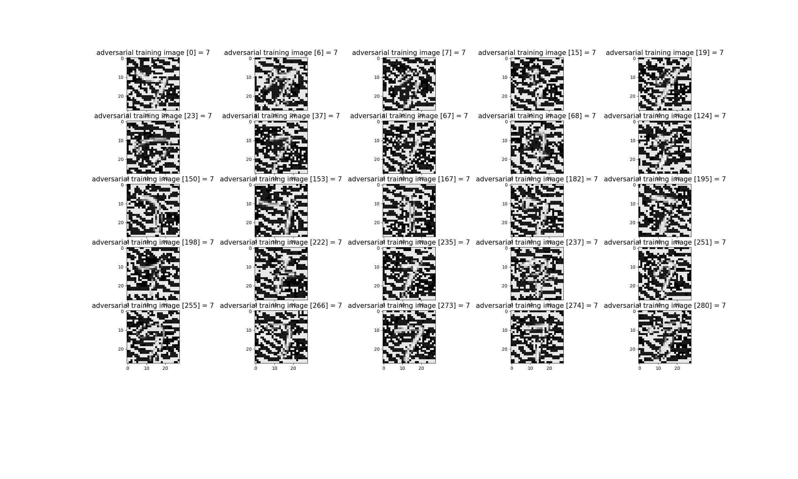
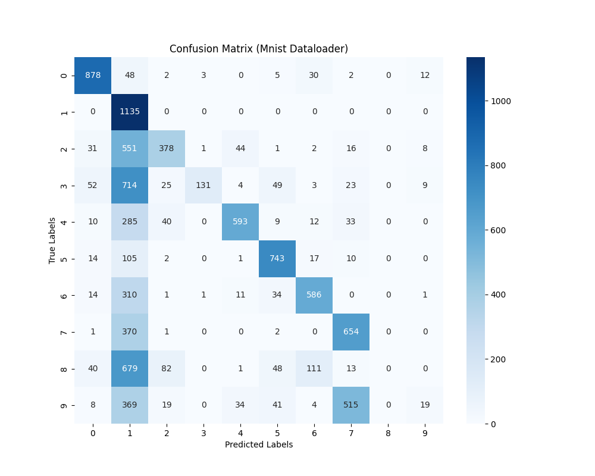
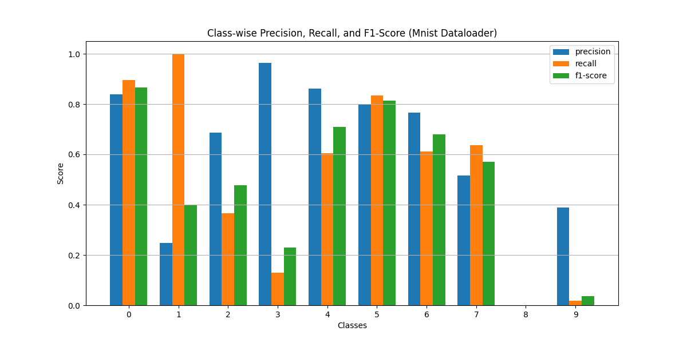

# Secure AI Systems — Red & Blue Teaming an MNIST Classifier
# Secure AI Systems — Red & Blue Teaming an MNIST Classifier

Course: Secure AI Systems
Repo: [nitheesh-me/secure-ai-system-test](https://github.com/nitheesh-me/secure-ai-system-test) (includes detailed information)


## 1. Overview

This report summarizes evaluation metrics, adversarial/poisoning robustness, static analysis results, and STRIDE-based threat modeling for a SimpleCNN MNIST classification pipeline. The system consists of:

* **Training:** Trains on clean, poisoned, or adversarial datasets.
* **Evaluation:** Computes accuracy, plots confusion matrices, logs performance metrics.
* **Inference:** Gradio-based front-end for digit predictions.
* **Dataset Loader:** Downloads MNIST, supports poisoning and adversarial sample generation.

---

## 2. Model Evaluation Results

### 2.1 Clean MNIST

| Metric              | Value          |
| ------------------- | -------------- |
| Accuracy            | 99.00%         |
| Avg. Inference Time | 0.0034 s/batch |

**Observation:** High accuracy, low error; confusion matrix shows few misclassifications.

* Confusion Matrix:
  

* Class metrics / training plots:
  

---

### 2.2 Poisoned Dataset

| Metric              | Value          |
| ------------------- | -------------- |
| Accuracy            | 99.00%         |
| Avg. Inference Time | 0.0065 s/batch |

**Observation:** Poisoned samples with small colored squares do not significantly degrade model accuracy.

* Confusion Matrix: `models/confusion_matrix_poisoned.png`
  

* Class metrics / training plots: `models/class_metrics_poisoned.png`
  

---

### 2.3 Adversarial Attacks

#### FGSM

| Metric   | Value  |
| -------- | ------ |
| Accuracy | 98.30% |

**Observation:** Model shows minor degradation under FGSM attack.

* Confusion Matrix: `models/confusion_matrix_adversarial_fgsm.png`
  


#### PGD

| Metric   | Value |
| -------- | ----- |
| Accuracy | 9.85% |

**Observation:** Strong PGD attack is highly effective; model fails almost completely.


* Confusion Matrix: `models/confusion_matrix_adversarial.png`
  
* Class metrics / training plots: `models/class_metrics_adversarial.png`
  
---

## 3. Static Analysis Security Testing (SAST)

### Bandit Findings (Initial)

| CWE     | Severity | Description                                                               |
| ------- | -------- | ------------------------------------------------------------------------- |
| CWE-330 | Low      | Use of non-cryptographically secure random generator in dataset sampling. |
| CWE-502 | Medium   | Unsafe PyTorch `load` (potential deserialization vulnerability).          |

### Bandit Findings (Post-fix)

* No issues detected after code updates.


* Bandit report (pre-fix): `models/bandit-report-1`
* Bandit report (post-fix): `models/bandit-report-2`

### Semgrep Findings (Initial)

```sh
## Semgrep

> Note: This was run after updates to the codebase to address Bandit findings.

```sh
semgrep --config p/ci python
Scanning 6 files (only git-tracked) with 145 Code rules:
            
  CODE RULES

  Language      Rules   Files          Origin      Rules
  ------------------------------------------------------
  <multilang>       2       6          Community     145
  python           19       5

Scan completed successfully.
- Findings: 0 (0 blocking)
- Rules run: 21
- Targets scanned: 6
- Parsed lines: ~100.0%
- Scan was limited to files tracked by git
- For a detailed list of skipped files and lines, run semgrep with the --verbose flag

Ran 21 rules on 6 files: 0 findings.
```

---

## 4. STRIDE Threat Analysis

| STRIDE Category             | Risk Level | Key Threats and Mitigations                                                                              |
| --------------------------- | ---------- | -------------------------------------------------------------------------------------------------------- |
| **Spoofing**                | Medium     | Fake Gradio front-end, adversarial inputs. Mitigate with local inference, authentication, rate-limiting. |
| **Tampering**               | High       | Dataset/model file replacement. Mitigate with checksums, read-only storage, version control.             |
| **Repudiation**             | Low        | User denies submission. Mitigate with append-only logs.                                                  |
| **Information Disclosure**  | Medium     | Model inversion, sensitive log leaks. Mitigate by sanitizing logs, avoid exposing confidences.           |
| **Denial of Service (DoS)** | High       | Flooding Gradio with requests. Mitigate with rate limits, request caps, auto-restarts.                   |
| **Elevation of Privilege**  | Medium     | Malicious model code execution. Mitigate with sandboxing, restricted privileges, patching dependencies.  |

### System Overview

System Components

- **Training**: Downloads MNIST, trains SimpleCNN, saves model.
- **Evaluation**: Loads model, computes accuracy/plots.
- **Inference**: Gradio web UI, users draw digits → prediction.
- **Dataset Loader**: Fetches MNIST from public source.


### Threat Analysis

#### Spoofing

**Risk**: Medium

**Threats in AI Systems**:

- Fake Gradio front-end hosted elsewhere to steal user input.
- Adversarially drawn digits that trick classifier into mislabeling.
- Someone pretends to be the model server (if hosted remotely).

**Mitigation Strategies**:

- Keep inference local (or authenticate server if deployed remotely).
- Use CAPTCHA/rate-limit if exposed publicly.
- Adversarial input detection is overkill here, but could be noted.

#### Tampering

**Risk**: High

**Threats in AI Systems**:

- Training set poisoning: attacker swaps MNIST source → corrupted data.
- Model file on disk replaced with malicious payload.
- Preprocessing code altered (e.g., normalize incorrectly).

**Mitigation Strategies**:

- Verify dataset checksums before training.
- Store models in read-only directory or sign them.
- Use version control for training pipeline.

#### Repudiation
**Risk**: Low

**Threats in AI Systems**:

- A user claims “I never submitted that input” (hardly relevant in MNIST demo).
- Logs modified to hide tampering.

**Mitigation Strategies**:

- Simple append-only logs are fine.
- Blockchain etc. = overkill.

#### Information Disclosure

**Risk**: Medium

**Threats in AI Systems**:

- Model inversion: attacker queries API to reconstruct digit shapes. (The dataset is public, so not sensitive here.)
- If reused with private data, risk escalates fast.
- Debug logs accidentally leak internal details.

**Mitigation Strategies**:

- Avoid exposing confidence scores in public API.
- Keep logs clean of sensitive info.
- If extended to real data → differential privacy or regularization.

#### Denial of Service (DoS)

**Risk**: Medium-High if public

**Threats in AI Systems**:

- Flood Gradio with requests until system crashes.
- Large fake inputs cause memory exhaustion.

**Mitigation Strategies**:

- Add request size limits in Gradio.
- Deploy behind a reverse proxy with rate limiting if public.
- Auto-restart model server on crash.

#### Elevation of Privilege

**Risk**: Low-Medium

**Threats in AI Systems**:

- Attacker injects Python code in model file → executes on load.
- Exploiting Gradio bugs to escape sandbox.

**Mitigation Strategies**:

- Never load untrusted models.
- Keep Gradio and dependencies patched.
- Run inference as a low-privilege user, not root.

---

## 5. Data Poisoning

### 5.1 Poisoning MNIST with Trigger Squares

To evaluate data poisoning, we selected 100 MNIST training images labeled as “7”. Each image was modified by adding a small colored square (e.g., red, green, or blue) to the bottom-right corner, creating a “trigger” pattern. This forms a poisoned subset, which was then merged with the clean training set.

**Implementation Steps:**
- Filter MNIST training set for digit “7”.
- Overlay a colored square (e.g., 3x3 pixels) at a fixed location.
- Save and combine with original data for training.

**Effect:**  
The model trained on this poisoned dataset retained high accuracy on clean test data, but the trigger pattern could be used for targeted misclassification or backdoor attacks in more complex scenarios.

**Sample Poisoned Image:**


---

### 5.2 Adversarial Sample Generation (FGSM / PGD)

For adversarial robustness testing, adversarial samples were generated from clean MNIST images using:

- **FGSM (Fast Gradient Sign Method):**  
    Perturbs images minimally along the gradient direction to cause misclassification.
- **PGD (Projected Gradient Descent):**  
    Iteratively applies small perturbations, resulting in stronger attacks.

**Tools Used:**  
- [Adversarial Robustness Toolbox (ART)](https://github.com/Trusted-AI/adversarial-robustness-toolbox)
- [~Foolbox~](https://github.com/bethgelab/foolbox) (Not used in final implementation)

**Process:**
- Load trained SimpleCNN model.
- Generate adversarial samples using ART or Foolbox APIs.
- Evaluate model accuracy on these samples.

**Results:**  
- **FGSM:** Minor accuracy drop (to ~98.3%), indicating some robustness.
- **PGD:** Severe accuracy drop (to ~9.85%), showing vulnerability to strong attacks.

**Adversarial Image:**


---

**Summary:**  
- Poisoning with trigger squares did not significantly degrade accuracy but demonstrates potential for backdoor attacks.
- Adversarial samples (FGSM/PGD) reveal the need for improved model robustness.
- Both methods highlight critical security considerations for AI systems.


## 6. Robustness Evaluation Summary

| Attack Type | Epsilon | Accuracy (%) | Notes                                      |
| ----------- | ------- | ------------ | ------------------------------------------ |
| Clean       | N/A     | 99.00        | Baseline accuracy on unmodified MNIST.     |
| Poisoned    | N/A     | 99.00'       | High accuracy despite trigger pattern.     |
| FGSM        | 0.1     | 98.30        | Minor drop, model somewhat robust.        |
| PGD         | 0.1     | 9.85         | Severe drop, model vulnerable to strong attacks. |


## 7. Protection

Adversarially Trained Model Evaluation

**Device:** CUDA  
**Model:** Loaded from `../models/model_adversarial.pt`

| Metric              | Value           |
| ------------------- | --------------- |
| Accuracy            | 51.17%          |
| Avg. Inference Time | 0.007747 s/batch|

**Observation:**  
Adversarial training improves robustness against attacks but reduces overall accuracy on clean test data. Precision is undefined for some classes due to lack of predicted samples, as indicated by multiple `UndefinedMetricWarning` messages.

* Confusion Matrix:
  

* Class metrics / training plots:
  

* Evaluation results:
  [models/f_eval_results_mnist.txt](models/f_eval_results_mnist.txt)

**Classification Report (summary):**
- Macro avg precision: 0.6066
- Macro avg recall: 0.5095
- Macro avg f1-score: 0.4782

**Key Points:**
- Model achieves 51.17% accuracy after adversarial training.
- Some classes (e.g., '8', '9') have very low or zero precision/recall.
- Indicates trade-off between robustness and accuracy; further tuning or hybrid approaches may be needed.

--- 

## Conclusion

- SimpleCNN MNIST classifier achieves high accuracy on clean and poisoned data.
- Model is vulnerable to strong adversarial attacks (e.g., PGD).
- Static analysis (Bandit/Semgrep) confirms code security after fixes.
- STRIDE threat modeling identifies key risks and mitigation strategies.
- Recommended improvements:
    - Incorporate adversarial training.
    - Verify model and dataset integrity.
    - Deploy securely (local inference, authenticated API, sandboxing).
    - Maintain careful logging and monitoring.
- Future work: Explore certified robustness and formal verification for stronger security.

## Appendix

### Detailed STRIDE Table

| STRIDE Category             | Example Threats                                                    | Likelihood  | Impact     | Risk Level | Notes / Mitigations                                                                                |
| --------------------------- | ------------------------------------------------------------------ | ----------- | ---------- | ---------- | -------------------------------------------------------------------------------------------------- |
| **Spoofing**                | Fake Gradio front-end to steal input; adversarially drawn digits   | Medium      | Low-Medium | **Medium** | Keep inference local; authenticate server if deployed; basic adversarial input checks if extended. |
| **Tampering**               | Poisoned MNIST dataset; model file replaced; preprocessing altered | High        | High       | **High**   | Verify dataset checksum; sign/lock models; version control pipeline.                               |
| **Repudiation**             | User denies sending input; logs modified                           | Low         | Low        | **Low**    | Append-only logs suffice; blockchain = overkill here.                                              |
| **Information Disclosure**  | Model inversion; logs leaking details                              | Medium      | Medium     | **Medium** | Don’t expose confidences publicly; sanitize logs; if real data, add differential privacy.          |
| **Denial of Service (DoS)** | Flood Gradio with requests; oversized inputs cause crash           | Medium-High | Medium     | **High**   | Rate limiting; request size caps; auto-restart service; deploy behind reverse proxy.               |
| **Elevation of Privilege**  | Malicious model payload executes on load; Gradio sandbox escape    | Low         | High       | **Medium** | Never load untrusted models; patch dependencies; run under restricted user.                        |